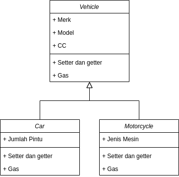
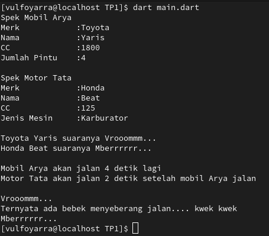

# TP1 Provis

## Desain OOP

Terdapat sebuah class bernama Vehicle yang mempunyai atribut Merk, Model, dan CC. Lalu, terdapat 2 class yang merupakan inheritance dari class Vehicle, yaitu Car dan Motorcycle. Class Car mempunyai atribut tambahan, yaitu Jumlah Pintu dan class Motorcycle mempunyai atribut tambahan, yaitu jenis mesin. Ketiga class tersebut mempunyai method berupa setter, getter, dan gas.

## Alur Program & Asynchronous
Di awal program, terdapat 2 buah object, yaitu mobilArya dan motorTattha. Selanjutnya, terdapat simulasi polymorphism yang menunjukkan bahwa kedua class mengeluarkan output yang berbeda meskipun menggunakan method yang sama. Setelah itu, terdapat proses synchronous yang menunjukkan bahwa mobilArya melaju 4 detik setelah dieksekusi. Terakhir, terdapat proses asynchronous yang menunjukkan bahwa motorTattha akan melaju 2 detik setelah mobilArya melaju. Tetapi, sebelum motorTattha melaju, terdapat bebek yang terlebih dahulu melakukan aksinya. Baru lah setelah itu, motorTattha melaju.

## Screenshots

